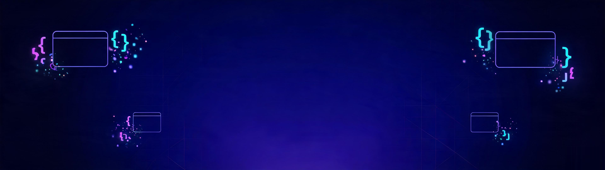

### Hi there 👋

<!--
**Neveryu/neveryu** is a ✨ _special_ ✨ repository because its `README.md` (this file) appears on your GitHub profile.

Here are some ideas to get you started:

- 🔭 I’m currently working on ...
- 🌱 I’m currently learning ...
- 👯 I’m looking to collaborate on ...
- 🤔 I’m looking for help with ...
- 💬 Ask me about ...
- 📫 How to reach me: ...
- 😄 Pronouns: ...
- ⚡ Fun fact: ...
-->


:construction_worker:  Front End Engineer

Vue & Node & JavaScript & React & CSS & Angular & TypeScript
<p align="left">
  <code></code>
  <code></code>
  <code></code>
  <code></code>
  <code></code>
  <code></code>
  <code></code>
  <code></code>
  <code></code>
</p>

<!--
  ════════════════════════════════════════════
  🎨 GitHub Profile README 使用指南
  （本注释不会显示在主页上，可放心保留）
  ════════════════════════════════════════════

  ① 创建特殊仓库
     新建一个与你 GitHub 用户名完全同名的公开仓库
     例：用户名 alice → 仓库名必须是 alice
     （勾选 Public，勾选 Add a README）

  ② 上传文件
     本 README.md 放仓库根目录
     assets/banner.jpg 放入同路径的 assets 文件夹
     .github/ 整个文件夹（workflows/snake.yml + scripts/activity-graph.js）
     也原样上传 —— 活跃度折线图就靠它每天自动生成

  ③ 启用 Action（活跃度折线图需要）
     仓库 Actions 页 → 启用 → 左侧 "Generate Profile Assets"
     → Run workflow 手动跑第一次，之后每天自动更新
     （跑完会多出 output 分支，折线图/贪吃蛇 SVG 都在里面）

  ④ 全局替换（重要！）
     YOUR_USERNAME → 你的 GitHub 用户名，共 20 处
     用编辑器 Ctrl/Cmd + H 一键替换即可
     （其中 6 处在贪吃蛇注释模块里，暂时不启用也无影响）

  ⑤ 填写内容
     全局搜索 TODO，每一处都附有示例提示

  ⑥ 预览
     推送后访问 github.com/你的用户名 查看效果
     文末注释里还有：贪吃蛇动画教程 + 一键换肤速查表

  ════════════════════════════════════════════
-->

<div align="center">



<a href="https://github.com/NeverYu">
  
</a>

</div>

---

## 👨‍💻 关于我 · About Me

> **人话版**：白天写 TypeScript 的前端工程师，晚上折腾 Rust 的独立开发者；相信「代码首先是写给人看的，顺便让机器执行」。

<!-- ▼ 极客终端卡片：只需替换 TODO 的值和 YOUR_USERNAME，格式与缩进别动
     左侧 ASCII 显示器是装饰画，不用改；字段名全是 neofetch 的梗——
     OS=职业身份 Kernel=核心技能 Uptime=编程年限 Shell=常用环境
     Editor=编辑器 Ping=坐标 Memory=冷知识或自嘲 -->

```bash
$ neofetch
    ┌───────────────┐     YOUR_USERNAME@github
    │ >_            │     ─────────────────────────
    │               │     OS:      TODO: 职业身份（例：前端工程师）
    │               │     Kernel:  TODO: 核心技能（例：TypeScript · React）
    │               │     Uptime:  TODO: 编程年限（例：6 年，仍在编译中）
    │               │     Shell:   TODO: 常用环境（例：zsh + tmux + Docker）
    │               │     Editor:  TODO: 编辑器（例：Neovim，btw）
    │               │     Ping:    TODO: 坐标（例：Beijing · UTC+8）
    │               │     Memory:  TODO: 冷知识或自嘲（例：██████░░░ 咖啡因 66%）
    └───────┬───────┘
       ┌────┴────┐
       └─────────┘

$ sudo make friend
[sudo] YOUR_USERNAME 的密码: ********
make: *** [friend] 被拒绝：友谊需要双向握手（破冰方式：发邮件 / 开个 issue）

$ cat chat-topics.txt
TODO: 欢迎和我聊（例：前端架构 / Rust / 独立开发变现 / 键盘耳机发烧友）
```

Wechat: miracle421354532

Blog0: https://neveryu.github.io/neveryu/

Blog1: https://neveryu.blog.csdn.net/


## 🚀 我在做的事 · What I'm Up To

<table>
  <tr><td width="40" align="center">🔨</td><td width="80"><b>正在做</b></td><td>TODO：进行中的项目或工作</td></tr>
  <tr><td align="center">🌱</td><td><b>正在学</b></td><td>TODO：正在学习的技术 / 领域</td></tr>
  <tr><td align="center">🧪</td><td><b>正在折腾</b></td><td>TODO：业余在玩的东西</td></tr>
  <tr><td align="center">📖</td><td><b>正在读</b></td><td>TODO：最近在读的书</td></tr>
</table>

## 🧰 技术栈 · Tech Stack

<!-- 图标去 skillicons.dev 挑选替换（i= 后面用逗号分隔）；
     建议只保留你真正掌握的，宁缺毋滥，避免变成「logo 汤」 -->

<div align="center">

**语言 · Languages**

[](https://skillicons.dev)

**前端 · Frontend**

[](https://skillicons.dev)

**后端 & 运维 · Backend & DevOps**

[](https://skillicons.dev)

**工具 · Tools**

[](https://skillicons.dev)

</div>

## 📊 GitHub 数据 · Stats

<div align="center">
  <a href="https://github.com/anuraghazra/github-readme-stats">
    
  </a>
  <a href="https://github.com/DenverCoder1/github-readme-streak-stats">
    
  </a>
  <a href="https://github.com/anuraghazra/github-readme-stats">
    
  </a>
</div>

<div align="center">
  <a href="https://github.com/ryo-ma/github-profile-trophy">
    
  </a>
</div>

## 📈 活跃度 · Contribution Graph


## 📮 联系我 · Reach Me

<!-- href="TODO" 换成你的链接；用不到的徽章直接删掉整行即可 -->

<div align="center">

[](mailto:TODO@gmail.com)
[](https://TODO)
[](https://space.bilibili.com/TODO)
[](https://juejin.cn/user/TODO)
[](https://x.com/TODO)
[](https://t.me/TODO)

</div>

---

<div align="center">


<br/>

**「种一棵树最好的时间是十年前，其次是现在。」**

</div>

<br/>

<div align="center">
  
</div>

<!--
  ════════════════════════════════════════════
  🎨 一键换肤速查表（可选）
  ════════════════════════════════════════════

  当前主题：Tokyo Night（深蓝紫夜色 + 霓虹点缀）

  想整体换配色？全局替换以下关键值：

  ① 统计卡片 / 连胜 / 奖杯
     theme=tokyonight
     可换：dracula / synthwave / radical / nord / vue /
           algolia / github_dark / one_dark_pro / gruvbox / monokai

  ② 活跃度折线图（由 Action 自动生成，改色后需重跑 workflow）
     改 .github/scripts/activity-graph.js 顶部的 THEMES：
     dark: bg=1a1b27 title=a9b1d6 line=7aa2f7 point=bb9af7
     light: bg=ffffff title=24283b line=7aa2f7 point=bb9af7

  ②' 贪吃蛇（同样由 Action 生成）
     改 .github/workflows/snake.yml 里的 color_snake / color_dots 参数

  ③ 打字机文字颜色
     color=7AA2F7（typing-svg URL 中）

  ④ 联系徽章底色
     BB9AF7 / 7DCFFF / 7AA2F7 / 9ECE6A / E0AF68 / 2AC3DE

  ⑤ 头图
     直接替换 assets/banner.jpg（保持同路径同名）

  ⑥ 波浪页脚渐变
     capsule-render URL 中的 0:1a1b27,50:7aa2f7,100:bb9af7

  参考色板（背景 · 主色 · 辅色 · 点缀 · 强调）：
    Tokyo Night  1a1b27 · 7aa2f7 · bb9af7 · 7dcfff · 9ece6a
    Dracula      282a36 · bd93f9 · ff79c6 · 8be9fd · 50fa7b
    Nord         2e3440 · 88c0d0 · a3be8c · b48ead · ebcb8b
    Gruvbox      282828 · fabd2f · b8bb26 · 83a598 · d3869b

  ════════════════════════════════════════════
-->
