### Hello

<picture>
  <source media="(prefers-color-scheme: dark)" srcset="assets/card-dark.svg" />
  <source media="(prefers-color-scheme: light)" srcset="assets/card-light.svg" />
  
</picture>

<!--
**Neveryu/neveryu** is a ✨ _special_ ✨ repository because its `README.md` (this file) appears on your GitHub profile.

Here are some ideas to get you started:

- 🔭 I’m currently working on ...
- 🌱 I’m currently learning ...
- 👯 I’m looking to collaborate on ...
- 🤔 I’m looking for help with ...
- 💬 Ask me about ...
- 📫 How to reach me: ...
- 😄 Pronouns: ...
- ⚡ Fun fact: ...
-->

<!--
  ════════════════════════════════════════════
  🎨 GitHub Profile README 使用指南
  （本注释不会显示在主页上，可放心保留）
  ════════════════════════════════════════════

  ① 创建特殊仓库
     新建一个与你 GitHub 用户名完全同名的公开仓库
     例：用户名 alice → 仓库名必须是 alice
     （勾选 Public，勾选 Add a README）

  ② 上传文件
     本 README.md 放仓库根目录
     assets/banner.jpg 放入同路径的 assets 文件夹
     .github/ 整个文件夹（workflows/snake.yml + scripts/activity-graph.js）
     也原样上传 —— 活跃度折线图就靠它每天自动生成

  ③ 启用 Action（活跃度折线图需要）
     仓库 Actions 页 → 启用 → 左侧 "Generate Profile Assets"
     → Run workflow 手动跑第一次，之后每天自动更新
     （跑完会多出 output 分支，折线图/贪吃蛇 SVG 都在里面）

  ④ 全局替换（重要！）
     YOUR_USERNAME → 你的 GitHub 用户名，共 20 处
     用编辑器 Ctrl/Cmd + H 一键替换即可
     （其中 6 处在贪吃蛇注释模块里，暂时不启用也无影响）

  ⑤ 填写内容
     全局搜索 TODO，每一处都附有示例提示

  ⑥ 预览
     推送后访问 github.com/你的用户名 查看效果
     文末注释里还有：贪吃蛇动画教程 + 一键换肤速查表

  ════════════════════════════════════════════
-->

---

## 👨‍💻 关于我 · About Me

### 白天写 Nuxt 的前端工程师，晚上折腾 Rust 的独立开发者；

Blog: https://neveryu.blog.csdn.net/

基金: https://yu.apig.edu.pl/react-fund/

Wechat: 

## 🚀 我在做的事 · What I'm Up To

<table>
  <tr><td width="40" align="center">🔨</td><td width="100"><b>正在做</b></td><td>最近在做小程序与开源项目，探索更好用、更有趣的全栈工具。</td></tr>
  <tr><td align="center">🌱</td><td><b>正在学</b></td><td>深入学习 TypeScript、React、Vue 与 Node.js，逐步拓展 Rust 全栈开发能力。</td></tr>
  <tr><td align="center">🧪</td><td><b>正在折腾</b></td><td>把想法快速做成可用的小产品，研究自动化、数据可视化和 AI 辅助开发。</td></tr>
  <tr><td align="center">📖</td><td><b>正在读</b></td><td>阅读优秀开源项目的源码与工程实践，持续提升代码质量和系统设计能力。</td></tr>
</table>

## 🧰 技术栈 · Tech Stack

<!-- 图标去 skillicons.dev 挑选替换（i= 后面用逗号分隔）；
     建议只保留你真正掌握的，宁缺毋滥，避免变成「logo 汤」 -->

**语言 · Languages**

**前端 · Frontend**

**后端 & 运维 · Backend & DevOps**

**工具 · Tools**

## 📊 GitHub 数据 · Stats

  
  
  

  

## 📈 活跃度 · Contribution Graph

## 📮 联系我 · Reach Me

<!-- href="TODO" 换成你的链接；用不到的徽章直接删掉整行即可 -->

---

 

**「当所有匆忙随着夜色落幕、你才与自己相见」**

 

 

[魔法棒] 支付宝的黑卡活动，扫码可以额外领1000V钻，能换点话费啥的，感兴趣的可以扫码看看

 

  

<!--
  ════════════════════════════════════════════
  🎨 一键换肤速查表（可选）
  ════════════════════════════════════════════

  当前主题：Tokyo Night（深蓝紫夜色 + 霓虹点缀）

  想整体换配色？全局替换以下关键值：

  ① 统计卡片 / 连胜 / 奖杯
     theme=tokyonight
     可换：dracula / synthwave / radical / nord / vue /
           algolia / github_dark / one_dark_pro / gruvbox / monokai

  ② 活跃度折线图（由 Action 自动生成，改色后需重跑 workflow）
     改 .github/scripts/activity-graph.js 顶部的 THEMES：
     dark: bg=1a1b27 title=a9b1d6 line=7aa2f7 point=bb9af7
     light: bg=ffffff title=24283b line=7aa2f7 point=bb9af7

  ②' 贪吃蛇（同样由 Action 生成）
     改 .github/workflows/snake.yml 里的 color_snake / color_dots 参数

  ③ 打字机文字颜色
     color=7AA2F7（typing-svg URL 中）

  ④ 联系徽章底色
     BB9AF7 / 7DCFFF / 7AA2F7 / 9ECE6A / E0AF68 / 2AC3DE

  ⑤ 头图
     直接替换 assets/banner.jpg（保持同路径同名）

  ⑥ 波浪页脚渐变
     capsule-render URL 中的 0:1a1b27,50:7aa2f7,100:bb9af7

  参考色板（背景 · 主色 · 辅色 · 点缀 · 强调）：
    Tokyo Night  1a1b27 · 7aa2f7 · bb9af7 · 7dcfff · 9ece6a
    Dracula      282a36 · bd93f9 · ff79c6 · 8be9fd · 50fa7b
    Nord         2e3440 · 88c0d0 · a3be8c · b48ead · ebcb8b
    Gruvbox      282828 · fabd2f · b8bb26 · 83a598 · d3869b

  ════════════════════════════════════════════
-->

<!--
  ═══════════════════════════════════════════
  OPERATOR ID · 使用指南（本注释不会显示在主页）
  ═══════════════════════════════════════════

  ① 新建与你的用户名完全同名的公开仓库
     （例：用户名 alice → 仓库名 alice，勾选 Public）
  ② 上传本 README.md 到仓库根目录，assets/ 文件夹原样上传
  ③ 改两处内容：
     · 卡片：assets/card-dark.svg 与 card-light.svg
       搜索「EDIT」—— 6 处文字（名字 / 头衔 / ID / 技术栈 / 坐标 / 状态行）
       深浅两份要同步改；状态行 ≤ 26 字符，超长会碰到光标
     · 正文：全局搜索 TODO；项目表格链接里的用户名占位符也要替换（3 处）
  ④ 推送后打开 github.com/<你的用户名> 查看效果

  ※ 这套设计零第三方服务：动画卡片存在你自己仓库里，
    不依赖任何公共实例 —— 永不掉链子
  ※ 卡片自带四组动画：打字机状态行 / 闪烁光标 / 呼吸指示灯 / 扫描线
  ※ 深浅色两版卡片会按访客系统主题自动切换
  ※ 换配色：编辑 svg 里 PALETTE 注释处的色值
  ═══════════════════════════════════════════
-->

